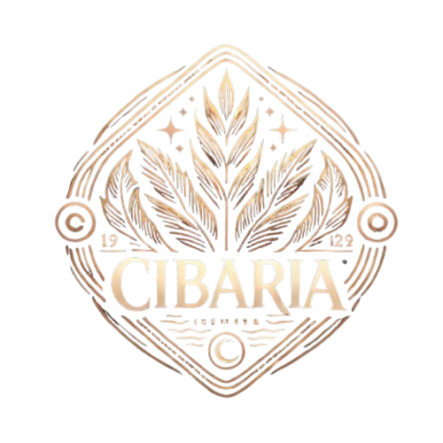

# 🍽️ Cibaria

**Cibaria** is a modern, full-stack recipe management application that brings culinary creativity to life. Built with Angular and Spring Boot, it provides a seamless platform for discovering, sharing, and managing recipes with friends and fellow food enthusiasts.



---

## ✨ Features

### 🔐 User Management

- **Secure Authentication**: Register and login with JWT-based security
- **User Profiles**: Personalized profiles with avatar and background images
- **Profile Settings**: Update username, description, email, and password
- **Admin Panel**: Administrative controls for user and recipe management

### 📖 Recipe Management

- **Create & Edit**: Rich recipe creation with ingredients, steps, and images
- **Image Upload**: Drag-and-drop image support with preview
- **Recipe Details**: Comprehensive recipe views with nutrition info
- **Recipe Rating**: 5-star rating system for community feedback
- **Favorites**: Save and organize your favorite recipes
- **Recipe Search**: Search recipes by name or ingredients

### 🔍 Advanced Search & Filtering

- **Smart Filters**: Filter by difficulty, category, servings, and prep time
- **Search Functionality**: Find recipes by name or ingredients
- **Language Support**: Multi-language recipe content
- **Responsive Filters**: Mobile-optimized filter interface

### 🌍 Internationalization

- **Bilingual Support**: Complete English and Polish translations
- **Localized Units**: Smart unit translation (tsp → łyżeczka, etc.)
- **Dynamic Language Switching**: Seamless language changes

### 📱 Modern UI/UX

- **Responsive Design**: Optimized for desktop, tablet, and mobile
- **Toast Notifications**: Real-time feedback for user actions
- **Progressive Enhancement**: Smooth animations and transitions
- **Dark Theme**: Elegant dark color scheme

---

## 🏗️ Architecture

### Frontend (Angular 18.2.7)

```
frontend/
├── src/app/
│   ├── components/          # Reusable UI components
│   ├── services/           # API services and business logic
│   └── Interface/          # TypeScript interfaces
├── public/
│   ├── i18n/              # Translation files
│   └── images/            # Static assets
└── styles.css             # Global styles
```

### Backend (Spring Boot 3.4.1)

```
backend/
├── src/main/java/com/kk/cibaria/
│   ├── recipe/            # Recipe domain logic
│   ├── user/              # User management
│   ├── rating/            # Rating system
│   ├── auth/              # Authentication
│   ├── admin/             # Admin functionality
│   ├── image/             # Image management
│   ├── ingredient/        # Ingredient handling
│   └── config/            # Security & CORS config
└── resources/
    └── application.yml
```

---

## 🚀 Quick Start

### Prerequisites

- **Node.js** 18+ and npm
- **Docker** and Docker Compose

### Application setup

1. **Create .env file in main directory**

```bash
DB_PASSWORD=root
DB_URL=jdbc:postgresql://cibaria_database:5432/postgres
POSTGRES_USER=postgres
POSTGRES_PASSWORD=root
POSTGRES_DB=postgres
CLOUD_NAME="Your cloduinary cloud"
API_KEY="Cloudinary api key"
API_SECRET_KEY="Cloudinary secret key"
SECRET_KEY="Token you genereate by running `mvn test -Dtest=JwtSecretMakerTest`"

```

2. **Run app with docker**

```bash
docker compose build
docker compose up
```

Frontend will start on `http://localhost:4200`

Backend will start on `http://localhost:8080`

Postgres will start on `http://localhost:5432`

### Frontend development setup

1. **Navigate and install:**

```bash
cd frontend
npm install
```

2. **Start development server:**

```bash
ng serve
```

Frontend will start on `http://localhost:4200`

---

## 🔧 API Documentation

### Authentication

| Method | Endpoint        | Description       |
| ------ | --------------- | ----------------- |
| POST   | `/authenticate` | User login        |
| POST   | `/register`     | User registration |

### Recipes

| Method | Endpoint                          | Description                    |
| ------ | --------------------------------- | ------------------------------ |
| GET    | `/recipes`                        | Get all recipes (with filters) |
| GET    | `/recipes/{id}`                   | Get recipe by ID               |
| POST   | `/recipes`                        | Create new recipe              |
| PUT    | `/recipes/{id}`                   | Update recipe                  |
| DELETE | `/recipes/{id}`                   | Delete recipe                  |
| POST   | `/recipes/{id}`                   | Rate a recipe                  |
| GET    | `/recipes/{id}/rating`            | Get user rating for recipe     |
| GET    | `/recipes/{id}/isOwner`           | Check if user owns recipe      |
| GET    | `/recipes/favourites/isFavourite` | Check if recipe is favourite   |
| POST   | `/recipes/favourites/add`         | Add recipe to favourites       |
| POST   | `/recipes/favourites/delete`      | Remove recipe from favourites  |
| GET    | `/recipes/search`                 | Search recipes by query        |

#### Recipe Filtering Parameters

- `page` (default: 1) - Page number
- `size` (default: 10) - Items per page
- `category` - Filter by recipe categories
- `difficulty` - Filter by difficulty level
- `servings` - Filter by serving size range (format: "min-max")
- `prepareTime` - Filter by preparation time range (format: "min-max")
- `isPublic` (default: true) - Show only public recipes
- `language` - Filter by recipe language
- `ingredients` - Filter by ingredient names

### Users

| Method | Endpoint                             | Description               |
| ------ | ------------------------------------ | ------------------------- |
| GET    | `/users`                             | Get all users             |
| GET    | `/users/{id}`                        | Get user by ID            |
| PUT    | `/users/{id}`                        | Update user               |
| PUT    | `/users/{id}/profile`                | Update user profile       |
| PUT    | `/users/{id}/email`                  | Update user email         |
| PUT    | `/users/{id}/password`               | Update user password      |
| DELETE | `/users/{id}`                        | Delete user               |
| GET    | `/users/aboutme`                     | Get current user profile  |
| GET    | `/users/recipes`                     | Get user's recipes        |
| GET    | `/users/favourites`                  | Get user's favourites     |
| PUT    | `/users/{userId}/profile-picture`    | Update profile picture    |
| PUT    | `/users/{userId}/background-picture` | Update background picture |

### Admin Panel

| Method | Endpoint                 | Description              |
| ------ | ------------------------ | ------------------------ |
| GET    | `/admin/users`           | Get all users (admin)    |
| DELETE | `/admin/users/{id}`      | Delete user (admin)      |
| PUT    | `/admin/users/{id}/role` | Update user role (admin) |
| GET    | `/admin/recipes`         | Get all recipes (admin)  |
| DELETE | `/admin/recipes/{id}`    | Delete recipe (admin)    |
| PUT    | `/admin/recipes/{id}`    | Update recipe (admin)    |
| GET    | `/admin/stats`           | Get admin statistics     |

### Image Management

| Method | Endpoint             | Description  |
| ------ | -------------------- | ------------ |
| POST   | `/image/addPhoto`    | Upload image |
| POST   | `/image/deletePhoto` | Delete image |

### Ratings

| Method | Endpoint               | Description     |
| ------ | ---------------------- | --------------- |
| POST   | `/recipes/{id}`        | Rate a recipe   |
| GET    | `/recipes/{id}/rating` | Get user rating |

---

## 🛠️ Development

### Frontend Commands

```bash
# Development server
ng serve

# Build for production
ng build

# Generate component
ng generate component component-name
```

### Database Access

```bash
# Access database container
docker exec -it cibaria_database -h <REMOTE_HOST> -p <REMOTE_PORT> -U <DB_USER> <DB_NAME>
```

---

## 🌐 Internationalization

### Adding New Languages

1. Create new translation file: `frontend/public/i18n/{lang}.json`
2. Add language option in components
3. Update language service configuration

### Translation Structure

```json
{
  "NAV": {
    "HOME": "Home",
    "RECIPES": "Recipes"
  },
  "ADD_RECIPE": {
    "TITLE": "Add a new recipe",
    "UNITS": {
      "TSP": "tsp",
      "TBSP": "tbsp"
    }
  }
}
```

---

## 🔒 Security Features

- **JWT Authentication**: Secure token-based authentication
- **Role-based Access Control**: Admin and user roles with different permissions
- **Authorization Headers**: Protected endpoints require valid tokens
- **Image Upload Security**: Secure file handling with Cloudinary integration

---

## 📊 Admin Dashboard

The admin panel provides comprehensive management capabilities:

- **User Statistics**: Total users, admin count, regular users
- **Recipe Analytics**: Total recipes, public vs private recipes
- **User Management**: Delete users, update roles and permissions
- **Recipe Moderation**: Review, edit, or remove recipes
- **System Overview**: Real-time statistics and health monitoring
